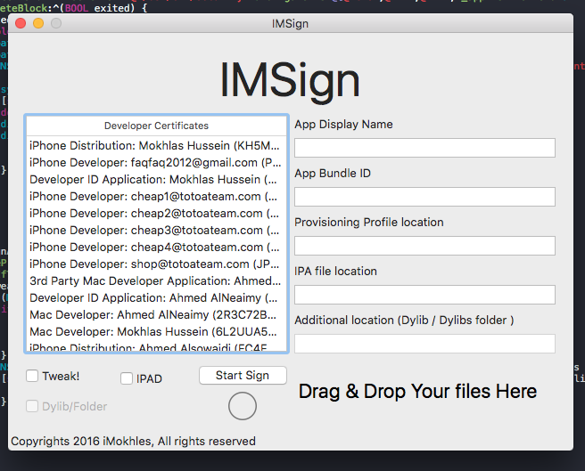
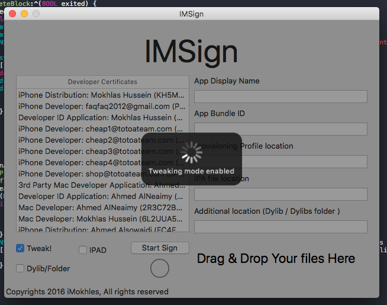

# IMSign
advanced app signer with tweaking app feature

### Features

* resign app with new profile
* tweak app
* enable native ipad screen
* change current app name
* enable whatsapp for ipad-ipod
* more comes ( check todo list )

### How-to-use

Resign App
----------

  

* choose your developer certificate from certificates list
* type new app name ( or type the current one ) [ because it won't work if it's blank ]
* type the app bundle id ( if you use the wildcard profile type any unique id) [ but if it's unique profile your bundle if should be the same as the profile id ]
* place your ipa file
* place your profile ( mobileprovision file )
* don't enable Tweak button ( it's only for tweaking app propose )
* enable iPad button to enable ( native IPAD screen for apps ) [ also for enable WhatsApp on IPAD-IPod ]
* click start Sign ( and wait till you see the new IPA file on your desktop )

Tweaking App
------------

  

* choose your developer certificate from certificates list
* type new app name ( or type the current one ) [ because it won't work if it's blank ]
* type the app bundle id ( if you use the wildcard profile type any unique id) [ but if it's unique profile your bundle if should be the same as the profile id ]
* place your ipa file
* place your profile ( mobileprovision file )
* enable Tweak button
* enable Dylib/Folder button ( to tweak the app using one single dylib file )
* disable Dylib/Folder button ( to tweak the app from folder contains tweaks files and bundles )
* if Dylib/Folder ( enabled ) place only one dylib file inside the drag&drop place
* if Dylib/Folder ( disabled ) place the whole folder which contains the tweak files and bundles inside the drag&drop place
* enable iPad button to enable ( native IPAD screen for apps ) [ also for enable WhatsApp on IPAD-IPod ]
* click start Sign ( and wait till you see the new IPA file on your desktop )

### TODO

- [ ] Tweaking already tweaked app
- [x] Improving provision profile grabber ( list profiles from Mac itself )
- [ ] Duplicating apps if using wildcard profile
- [ ] Adding section for plusplus tweak ( to tweak app using it easily without using extern sources )
- [ ] Add changing app current icon
- [ ] Other stuffs which i don't remember all of them now 

Credits
-------

[eni9889 / ppsideloader](https://github.com/eni9889/ppsideloader)

[ArtemVasnev / DragView](https://github.com/ArtemVasnev/AppInstaller/blob/master/AppInstaller/DragView.h)

[reliablehosting / GCDTask](https://github.com/reliablehosting/GCDTask)

[danielmj / DJProgressHUD_OSX](https://github.com/Tyilo/DJProgressHUD_OSX)

### License

	GNU LESSER GENERAL PUBLIC LICENSE
	                       Version 3, 29 June 2007

	 Copyright (C) 2007 Free Software Foundation, Inc. <http://fsf.org/>
	 Everyone is permitted to copy and distribute verbatim copies
	 of this license document, but changing it is not allowed.
